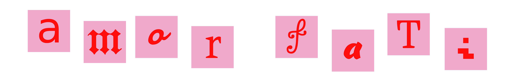

> a 3d interactive survival/escape game, where you have to try and escape the realm of the undead.

## Preamble

This was made as a submission to a 3rd year assignment from the modules Graphics and Visualization and Intelligent Systems (it was a joint assignment).

The graphics part is for GV and the path-finding algorithms implemented for the undead cover the requirements for IS.

We will be using Godot as the game engine to construct this 3d game due to its lightweight and also because I have some prior experience working with it for my submission in GMTK 2025.

Blender will be used for any 3d modeling done for the game.

## Group Roles

The assignments requires 4 members to work as a team to produce the resultant game and all the members must have equal contribution.

For GV:
- The world builder: Me
- The systems engineer: Sanojan
- The core developer: Thisanth
- The agent controller: Praveen

For IS:
- Graph formulation: Sanojan
- Dynamic adaptation: Thisanth
- A* heuristic search: Me
- Secondary search (BFS): Praveen

## Notes

There will be several levels that the player will have to progress through.

Each level will be more difficult to pass than the previous, and the agents will get better and better at following the player as the they level up.
